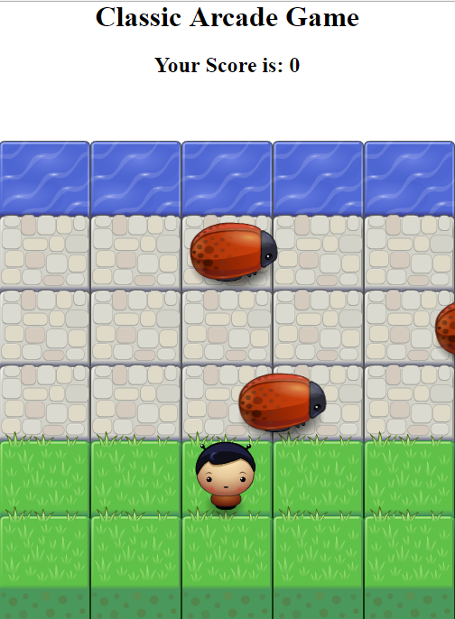

# Udacity Front-end Nonodegree - Project 3

#Class Arcade Game
I had to code a classic arcade game based on the game Frogger. The point of the game is to get your character from the grass over the road and into the water. The challenge is to avoid the bugs that travel on the road. If a bug is touched, the character is reset back at the beginning. Upon reaching the water, the user is also reset back to the beginning.

## How to Play:
1. Using the arrow keys on your keyboard, move upwards.

2. Try and avoid the cockroaches and try and jump into the water.

3. If you made it in the water, you can play again. If you collided with a cockroach, start againn.

## Online Version of Game
To play the game on github pages go to http://ccobb73.github.io/Udacity-Arcade-Game
